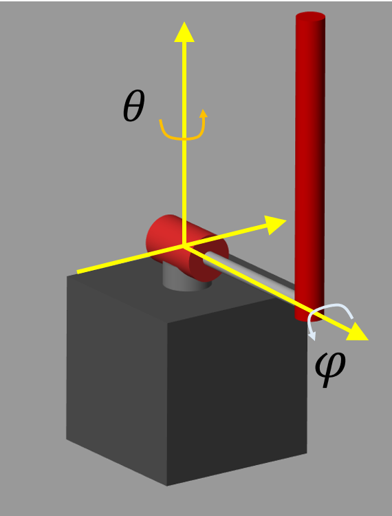

# PID制御を用いて倒立振子制御を設計
# 初期化

```matlab:Code
clear; clc;
SIMULATION_MODE = 0;    % 0:シミュレーション  1:実機

ctrlName = 'PID_controller';

if (SIMULATION_MODE == 1)
    clean_cache_folder(currentProject);    
end

```


```matlab:Code
% 初期角度、角速度
theta0   = 0/180*pi;
phi0     = 160/180*pi;
dtheta0  = 0;
dphi0    = 0;

% 振り子の角度指令値
ref_angle = pi;
```

# プラントモデル 


以下の図のように回転角度を定義する。





回転アームの角度を、振り子の回転角をと置く。


回転アームは上図正面方向にあるときにとおき、反時計周りの方向を正とする。


振り子は、上図真下に下がっているときにとおき、反時計周りの方向を正とする。


すなわち、振り子が鉛直真上に向いている時に角度となる。


プラントはDC Motorに掛ける印加電圧[V]を入力とし、Motorによって発生する回転トルクがアームを回転、その結果として振り子部が動く、1入力2出力４状態量（角度、角速度）の劣駆動系である。


, , 


プラントモデルはSimscapeを用いて構築した（「pendulumLib.slx」を参照）。


# プラントパラメーター


プラントのパラメータは実機の応答と一致するように、推定及び調整を行った。


```matlab:Code
plant_parameters;
```

# 制御設計


制御器は「PID_controller.slx」にて構築している。


```matlab:Code
open_system('PID_controller');
```


制御器は回転アームの角度、角速度、振り子の角度、角速度をフィードバックし、それぞれにゲインを掛けて足し合わせ、操作量を計算している。


制御器は回転アームの制御と振り子の制御に分かれており、回転アーム制御の操作量が振り子の角度指令値として入力される形となっている。回転アームの角度、角速度指令値、振り子の角速度指令値は常に0としている。


振り子の角度が90[deg]以下である場合、振り子角度、角速度のゲインの符号を反転させることで、振れ止め制御に切り替えることをしている。この時、振り子の角度指令値としては0を入力すること。


# シミュレーション


制御システムは「ClosedLoopSystem_PID.slx」に構築している。モデルを実行して、制御器とプラントモデルがどのように動作するか確認すること。また、「ClosedLoopSystem_PID_Exp.slx」Raspberry Pi と QUBE - Servo 2 を制御するためのモデルである。実行する前に、それらのハードウェアを接続すること。


```matlab:Code
theta_gain   = 0.162;
dtheta_gain  = 0.0356;
phi_gain     = 40;
dphi_gain    = 2;

load_system(ctrlName);
if (SIMULATION_MODE == 1)
    open_system('ClosedLoopSystem_PID_Exp');
    setActiveConfigSet(ctrlName, 'Config_raspi');
    save_system('ClosedLoopSystem_PID_Exp', [], ...
        'SaveDirtyReferencedModels', true);
else
    open_system('ClosedLoopSystem_PID');
    setActiveConfigSet(ctrlName, 'Config_sim');
    save_system('ClosedLoopSystem_PID', [], ...
        'SaveDirtyReferencedModels', true);
end

```

  


* Copyright 2021 The MathWorks, Inc.*


